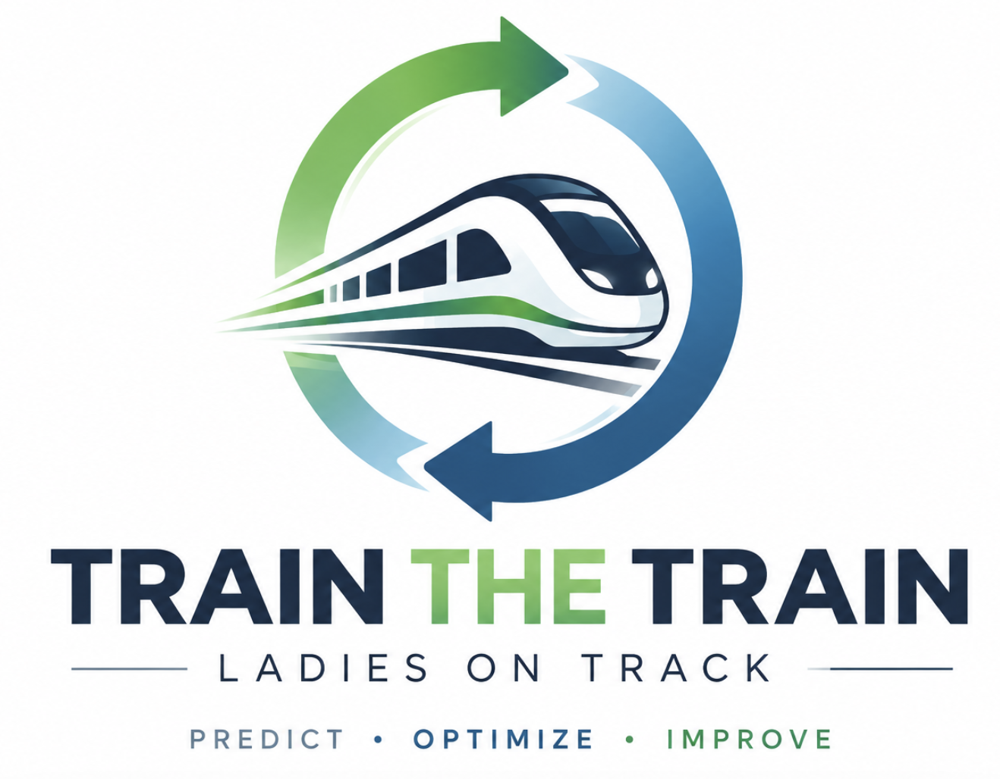
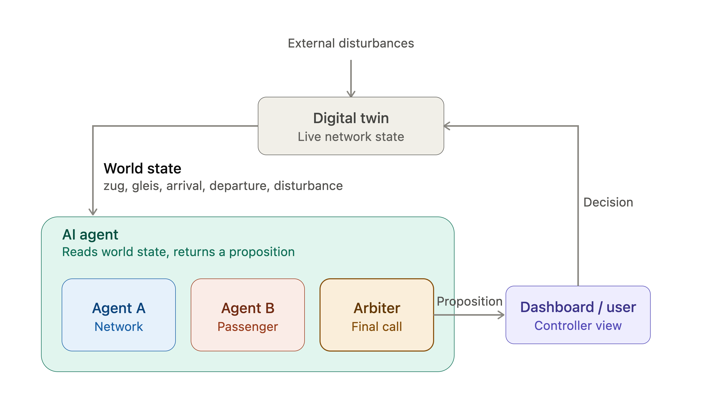

# train_the_train

<p align="center">
  
</p>

Optimizing re-scheduling platform for railway dispatchers.

`train_the_train` is a dispatcher cockpit for monitoring Hamburg Hbf rail operations, detecting disruptive delays, and comparing AI-generated rescheduling recommendations. It reads live station-board data, builds a local digital twin of the current corridor state, evaluates network and passenger trade-offs, and lets a controller accept or override the recommended plan.

## Product Flow



1. External disturbances appear in the live station-board data: delays, cancellations, platform changes, route information, and cause texts.
2. The app normalizes that feed into a digital twin: trains, platforms, passenger estimates, connections, and current disruption state.
3. Agent A optimizes for network flow by reducing total delay minutes and path conflicts.
4. Agent B optimizes for passengers by protecting transfers and reducing broken journeys.
5. The orchestrator compares both options, may create a blended proposal, and chooses the recommended action.
6. The dispatcher reviews the recommendation in the decision console, accepts it, or rejects it by applying an alternative.
7. The selected decision updates the local world state, scoreboard, and decision log.

## Project Structure

```text
train_the_train/
  app/
    _layout.tsx              App shell, providers, splash handling, error reporting
    (tabs)/
      index.tsx              Station overview and live movement map
      decision.tsx           Dispatcher decision console
      score.tsx              Impact and override scorecard
      log.tsx                Session decision history
  components/
    cockpit/                 Cockpit panels, badges, proposal cards, train rows
    ui/primitives/           Native/web wrappers used by shared UI
    MapView.tsx              Native map facade
    MapView.web.tsx          Web map implementation
  hooks/
    useCorridorFeed.ts       Polls the live corridor feed into app state
  lib/
    db-api.ts                DB feed adapters and normalization
    data.ts                  Hamburg/corridor reference data
    agents.ts                Recommendation and orchestrator logic
    store.ts                 Zustand state, incident lifecycle, decisions, score
    types.ts                 Domain types for trains, incidents, proposals, metrics
    navigation.ts            Navigation helpers
    posthog.ts               Optional web analytics setup
    registerServiceWorker.ts PWA service-worker registration
  assets/                    Product logo and bundled visual assets
  docs/assets/               README diagrams and documentation images
  public/                    Web manifest, HTML shell, install icons
```

## How It Works

The cockpit continuously polls the station-board feed in `useCorridorFeed.ts`. `db-api.ts` tries the available DB data sources, normalizes platform, route, timing, delay, and cancellation information, and produces a consistent corridor snapshot.

`store.ts` folds each snapshot into the app's digital twin. When a delay or cancellation is significant enough, it creates an incident. Minor incidents can be auto-applied; major incidents are held for the controller in the decision console.

`agents.ts` evaluates the incident with deterministic planning logic:

- Network agent: minimizes total delay minutes and downstream path conflicts.
- Passenger agent: protects transfers and reduces broken connections.
- Orchestrator: scores the options, may build a blended plan, and chooses the recommendation.

When the dispatcher accepts or rejects the recommendation, the selected proposal is applied as a local overlay. The app then updates the station view, the scorecard, and the decision log for the current session.

## Tech Stack

- Expo and React Native
- Expo Router
- TypeScript
- Zustand for cockpit state
- TanStack Query for feed polling
- HeroUI Native, Uniwind, and Tailwind CSS for UI styling
- React Native Maps on devices and a web map implementation for browser builds
- Workbox service worker for the installable web app

## Prerequisites

- Node.js `>=20.19.4`
- npm
- Expo tooling through `npx expo`

The project declares `npm@10.9.0`. If your global npm is newer, you can still use the commands below; for lockfile-sensitive work, run npm through `npx npm@10.9.0`.

## Run Locally

```sh
cd train_the_train
npm install
npx expo start
```

Then choose one of the Expo options:

- Press `i` for the iOS simulator.
- Press `a` for the Android emulator.
- Scan the QR code with Expo Go on a physical device.
- Press `w` to run the web app.

## Useful Commands

```sh
npm run lint
npm run format:check
npm run expo-check
npm run export:web
npm run build:pwa
npm run ios
npm run android
```

## Development Notes

- The live feed is platform-aware: browsers prefer the CORS-friendly DB REST source, while native builds can try the richer station-board source first.
- Passenger counts and transfer volumes are modeled estimates because live load data is not published by the feed.
- Decisions are session-local overlays. They do not alter the real DB feed; they show what the selected dispatching action would do inside the cockpit.
- The app is focused on Hamburg Hbf and the Hamburg-Hannover corridor reference data in `lib/data.ts`.
